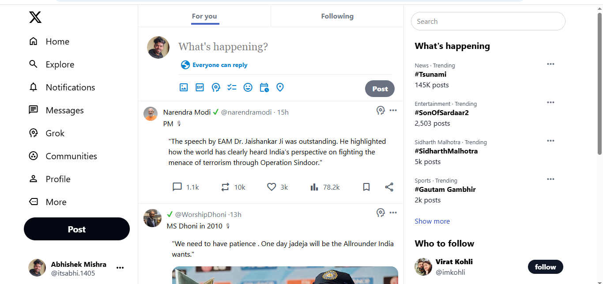

# XClone 🚀


A simple clone of **Twitter (X)** built using **Tailwind CSS**.  
This project is focused on learning frontend design, responsive layouts, and practicing Tailwind CSS utility classes.

---

## 📌 Features
- 🖼️ Clean and responsive UI similar to Twitter/X  
- 📱 Mobile-first design using Tailwind CSS  
- 🔍 Sidebar navigation and trending section  
- 📝 Post box UI (tweet input)  
- 🎨 Custom styling with Tailwind utilities  

---

## 🛠️ Tech Stack
- **HTML5**  
- **Tailwind CSS**   

---

## 📂 Project Structure
XCLONE/
│── node_modules/           # (ignored in .gitignore, not uploaded)
│── src/
│   ├── css/                # CSS folder
│   │   ├── input.css       # Tailwind config + custom styles
│   │   ├── output.css      # Compiled Tailwind CSS file
│   ├── image/              # Project images
│   ├── index.html          # Main HTML file
│── package.json            # Project metadata & dependencies
│── package-lock.json       # Dependency lock file

## 📸 Screenshots

Here’s the preview of the XClone project:



## 🚀 Getting Started
1. Clone this repository  
   ```bash
   git clone https://github.com/abhitechyy/xclone.git

2. Navigate to the project folder :

cd xclone

4. Open index.html in your browser

🤝 Contributing

This project is for learning purposes. Feel free to fork, improve, and create pull requests!

📜 License

This project is licensed under the MIT License – see the LICENSE
 file for details.
 

## 👨‍💻 Author
**Abhishek Mishra**  

📧 [abhishekmishra65836583@gmail.com](mailto:abhishekmishra65836583@gmail.com)  
🔗 [LinkedIn](https://www.linkedin.com/in/iamabhishekm-dev)
